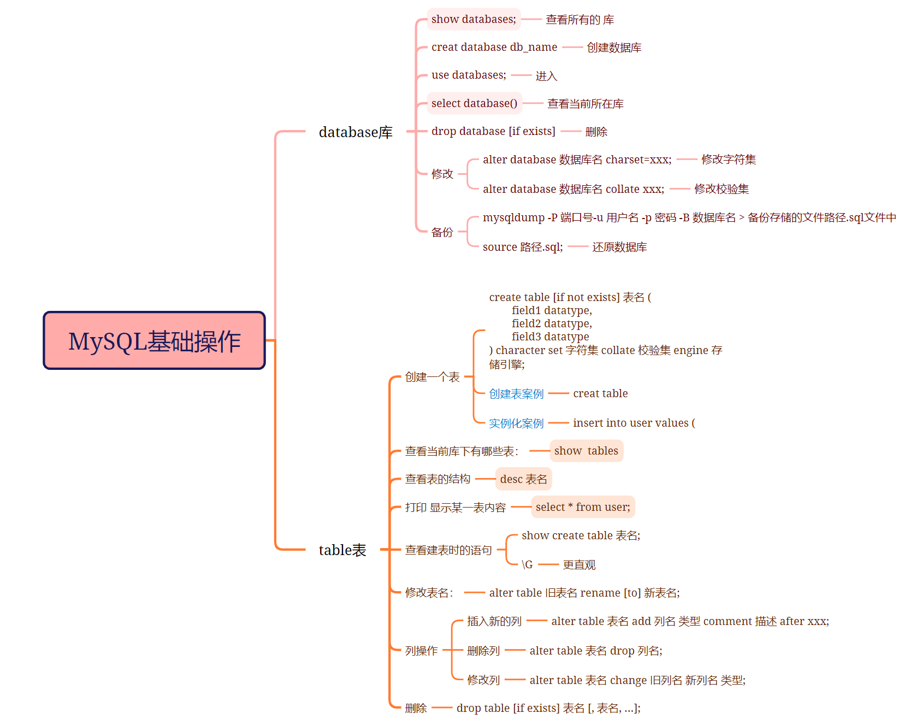
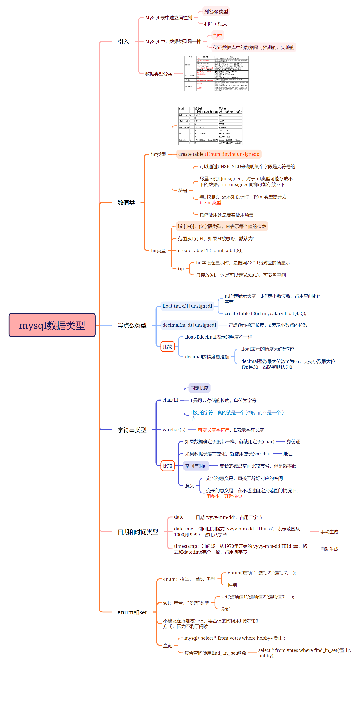
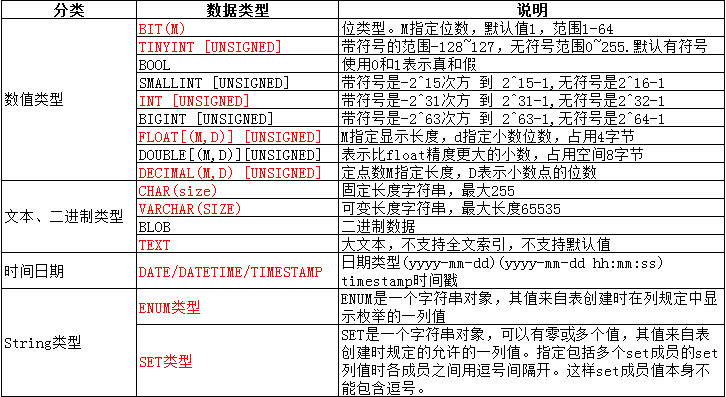
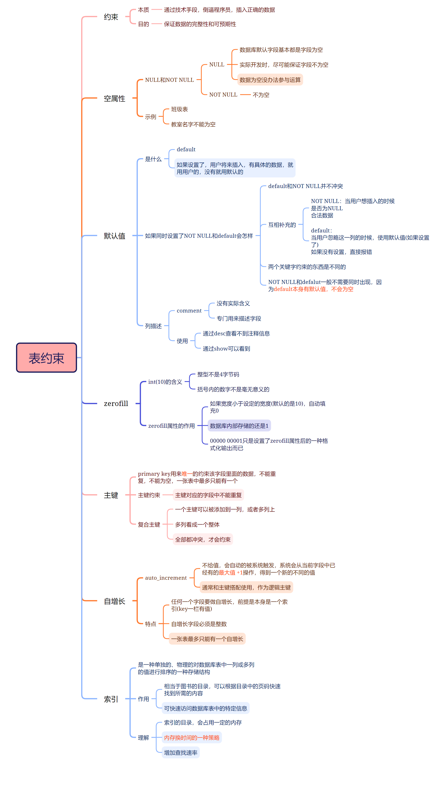

## MYSQL

MySQL 本质：一个基于 C/S（Client/Server）模式的网络服务。

- mysql 是数据库服务的客户端。

- mysqld 是数据库服务的服务器端。

数据库本质其实也是文件！！只不过这些文件并不是由程序员直接操作，而是由数据库服务帮(mysqld)我们进行操作。

数据库的创建本质：
- 在 Linux 系统下创建一个目录。
- 表的创建本质：创建相应的文件。
- 数据存储的本质：将数据以结构化的方式存储到这些文件中。
- 程序员不需要直接操作文件系统，而是通过 SQL 语句与 MySQL 服务交互，服务负责在磁盘上执行具体的操作。

MySQL Server来讲主要功能由三层构成：
- 第一层 ： 连接池 —— 主要是安全连接管理(连接管理、鉴权、保证安全…)
- 第二层 ： 比如说客户端会下达各种SQL指令，收到指令然后会对指令做各种语法、词法分析，甚至会对SQL语句做一定程度优化按照SQL协议然后下达给下一层。
- 第三层 ：存储引擎 —— 匹配的就是一个一个存储引擎，作用有点像计算机体系结构中的驱动。下面可能有不同种类的引擎，这些存储引擎从上层接收下达下来的经过词法语法调优过的SQL语句，然后存储引擎对这些SQL语句解释，说白了最下面这一层才是真正干事的，它帮我们去访问指定的数据库文件，访问指定的表。把数据进行增删查改。

#### 存储引擎
存储引擎：数据库管理系统如何存储数据、如何为存储的数据建立索引和如何更新、查询数据等技术的实现方法
MySQL的核心：插件式存储引擎，支持多种存储引擎——解释 SQL 语句

#### 库操作



- 创建数据库 ：
    ```
    CREATE DATABASE [IF NOT EXISTS] db_name [create_specification];
    create_specification:
        [DEFAULT] CHARACTER SET charset_name  # 指定数据库采用的字符集
        [DEFAULT] COLLATE collation_name # 指定数据库字符集的校验规则
    ```
- 修改数据库 ：
``ALTER DATABASE db_name [alter_spacification];`` 
- 删除数据库 ：
``DROP DATABASE [IF EXISTS] db_name;``
- 备份和恢复 ：mysqldump 导出的本质是一个巨大的、纯文本的 SQL 脚本文件。
``mysqldump -P 3306 -u root -p 密码 -B 数据库名 > 数据库备份存储的文件路径`` 
``mysql> source 数据库备份存储的文件路径; ``

#### 表操作

- 创建表 ：
    ```
    CREATE table table_name (
    field1 datatype,
    field2 datatype,
    field3 datatype
    ) character set 字符集 collate 校验规则 engine 存储引擎; 
    ```
不同的存储引擎，创建表的文件不一样
  - 存储引擎是MyISAM，在数据目中有三个不同的文件
    Users.frm：表结构
    Users.MYD：表数据
    Users.MYI：表索引
  - 存储引擎是InnoDB，在数据目中有两个不同的文件
    Users.frm：表结构
    Users.ibd：表数据&表索引

- 查看表 ：
``desc db_name;``

- 修改表 ：
    ```
    ALTER TABLE tablename ADD (column datatype [DEFAULT expr][,column datatype]...);
    ALTER TABLE tablename MODIfy (column datatype [DEFAULT expr][,column datatype]...); 
    ALTER TABLE tablename DROP (column);
    ```
- 删除表 ：
``DROP [TEMPORARY] TABLE [IF EXISTS] tbl_name [, tbl_name] ... ``
删除某列：
``alter table user drop column;``

#### 数据类型


- **数据约束**：如果我们向mysql特定的类型中插入不合法的数据，MySQL一般都是直接拦截我们，不让我们做越界的操作!

- 数值类型分类


- enum：枚举，“单选”类型；enum('选项1','选项2','选项3',...)。
    - enum枚举类型给我提供约束，换句话说插入时只能插入枚举的类型，不允许插入除该枚举类型外其他任何字符。
    - 当enum枚举类型在插入的时候，可以直接写这个枚举限定的常量，也可以写对应常量的下标
    - 注意这个数字下标从1开始，分别代表第一个枚举值,第二个枚举值等。有几个就只能到几，超过不行
- set：集合，“多选”类型；set('选项值1','选项值2','选项值3', ...)
  - 在向一个set集合中插入的时候，这个数字代表的是位图。集合中有几个类型就有几个比特位，比特位从低向高依次代表set类型中从左向右。比特位的位置代表是那个类型，比特位为0为1代表是否是有这个类型。 

集合查询使用find_ in_ set函数
- find_in_set只能用来检查一个元素是否在集合中。
    - 如果存在，则返回对应的下标；
    - 查找过程是判断元素是否在集合中，而非直接判断相等性。

复合条件查询示例
- 如果需要查询爱好的集合中同时包含“代码”和“羽毛球”的记录，可以通过组合多个find_in_set函数并使用逻辑运算符AND来实现；


#### 表约束



**索引** ：
- 定义
    - 物理存储结构：在关系数据库中，索引是一种单独的、物理的对数据库表中一列或多列的值进行排序的一种存储结构。
    - 组成：索引是某个表中一列或若干列值的集合，以及相应的指向表中物理标识这些值的数据页的逻辑指针清单。
- 使用
    - 快速定位：索引提供了指向存储在表的指定列中的数据值的指针，并根据指定的排序顺序对这些指针排序。
    - 提高查询效率：数据库使用索引以找到特定值，然后顺指针找到包含该值的行，从而使得对应于表的SQL语句执行得更快。

**唯一键** ：
- 作用 ：在一张表中，唯一键用于对多个需要唯一性约束的字段进行限制。虽然表中只能有一个主键，但可以使用多个唯一键来确保数据唯一性。
- 更多地用于业务逻辑上的唯一性约束，允许字段为空，并且多个空值不会影响唯一性比较。

**外键** ：
- 定义 ：外键约束用于建立主表和从表之间的关联关系，主要定义在从表上，主表必须包含主键或唯一键。
- 在从表中设置外键约束：`foreign key (字段名) references 主表(列)`

#### CRUD
- 插入 ：
    ```
    INSERT [INTO] table_name
        [(column [, column] ...)] #列字段
        VALUES (value_list) [, (value_list)] ... #列字段的内容
        
    value_list: value, [, value] ...
    ```
- 更新 ：由于主键或者唯一键对应的值已经存在而导致插入失败。选择性的进行同步更新操作语法,如果不存在就插入，存在发生主键或者唯一键冲突不要报错，接着执行后面的修改语句。
    ```
    INSERT ... ON DUPLICATE KEY UPDATE
        column = value [, column = value] ...
    ```
    ```
    UPDATE table_name SET column = expr [, column = expr ...]
    [WHERE ...] [ORDER BY ...] [LIMIT ...] 一般在update的时候必须采用对应where子句进行条件筛选
    ```
- 替换 ：主键或者唯一键没有冲突，则直接插入; 如果冲突，则删除后再插入。
    ```
    REPLACE INTO (...) values (...)
    ```
- 查找 ：
    ```
    SELECT
        [DISTINCT] {* | {column [, column] ...}  # distinct：对内容进行去重
        [FROM table_name] # 从那个表筛选
        [WHERE ...] # 筛选条件
        [ORDER BY column [ASC | DESC], ...] # 对筛选结果排序
        LIMIT ... # 限定筛选出来的条数
    ```
    总结关键字执行顺序
    from > on> join > where > group by > with > having > select（含重命名） > distinct > order by > limit
- 删除 ：
  ```
  DELETE FROM table_name [WHERE ...] [ORDER BY ...] [LIMIT ...]
  ```
  截断表 ：
  ``TRUNCATE [TABLE] table_name``
  - 只能对整表操作，不能像 DELETE 一样针对部分数据操作；
  - 实际上 MySQL 不对数据操作，所以比 DELETE 更快，但是TRUNCATE在删除数据的时候，并不经过真正的事物，所以无法回滚
  - 会重置 AUTO_INCREMENT 项
    **Truncate的特点**
      - 由于 TRUNCATE 不记录自己的操作到日志中，也不将其作为事务的一部分，因此它仅是简单地清空表中的数据，这样做的结果是 TRUNCATE 的执行速度较快。

      - TRUNCATE 因为其非事务性及不记录日志的特点，在执行速度上有优势
        但在数据恢复和一致性方面不如 DELETE。

- 聚合函数 ：
    ```
    COUNT([DISTINCT] expr) 返回查询到的数据的数量
    SUM([DISTINCT] expr)   返回查询到的数据的总和
    AVG([DISTINCT] expr)   返回查询到的数据的平均值
    MAX([DISTINCT] expr)   返回查询到的数据的最大值
    MIN([DISTINCT] expr)   返回查询到的数据的最小值
    ```

- 分组查询 ：
  分组是对表中的数据进行分组，分完组之后，在对表中每一组进行相关聚合统计。
  - having经常和group by搭配使用, 作用有些像where。
    where是对具体的任意列进行条件筛选
    having对分组聚合之后的结果进行条件筛选。

- 日期函数 ：
    ```
    函数名称                  描述
    current_date()           获取当前日期
    current_time()           获取当前时间
    current_timestamp()      获取当前时间戳
    date(datetime)           返回 datetime 参数的日期部分
    date_add(date, interval d_value_type)   在 date 中添加日期或时间，interval 后的数值单位可以是 year、minute、second、day
    date_sub(date, interval d_value_type)   在 date 中减去日期或时间，interval 后的数值单位可以是 year、minute、second、day
    datediff(date1, date2)   计算两个日期之间的差值，单位是天
    now()                    获取当前日期时间
  ```

#### 索引
MySQL和硬盘进行I/O的流程 ：
- MySQL向操作系统请求16KB数据，InnoDB 的一个数据页默认是 16 KB。。
- 操作系统从磁盘读取4个4KB的数据块，加载到文件缓存区。
- 数据从文件缓存区加载到MySQL的Buffer Pool。
- MySQL在Buffer Pool中对数据进行处理。
- 更新数据时，MySQL将数据写入Buffer Pool，然后通过操作系统刷新到磁盘。

数据读取流程
- 磁盘上的文件数据：首先会被读到操作系统的文件缓存区中。
- MySQL的Buffer Pool：MySQL在启动时会为自己申请一个Buffer Pool，用于缓存数据。MySQL与操作系统之间进行I/O交互的基本单位是16KB，这是为了提高效率，减少I/O成本。

Page的概念
- Page：MySQL的基本数据单位，大小为16KB。
- Buffer Pool：可以加载多个Page，使用双向链表连接。
- 主键：MySQL会默认按照主键对数据进行排序。
- 无主键：如果没有主键，默认插入的顺序就是查询时的顺序

**为什么IO交互要用Page？**
**Page的重要性**
- 问题： MySQL和磁盘进行I/O交互时，采用Page方案的原因是为了提高效率。如果每次只加载需要的数据，例如查找id=2的记录，第一次加载id=1，第二次加载id=2，一次一条记录，那么就需要2次I/O。如果要找id=5，那么就需要5次I/O。
- 批量加载：但如果这5条记录（或更多）都被保存在一个Page中（16KB，能保存很多记录），那么第一次I/O查找id=2时，整个Page会被加载到MySQL的Buffer Pool中，完成一次I/O。此后如果查找id=1,3,4,5等，完全不需要进行I/O，而是在内存中进行。因此，在单Page内大大减少了I/O的次数。

局部性原理
- 不能严格保证：我们不能严格保证用户下次查找的数据一定在同一个Page内，但有很大概率，因为有局部性原理。
- 主要矛盾：IO效率低下的主要矛盾不是单次I/O数据量的大小，而是I/O的次数。

有主键的表插入数据时的排序
- 乱序插入，有序查询：我们向一个具有主键的表中，乱序插入数据，发现数据会自动排序。
- 结论：数据最终以Page为单位进行管理，而Page是先描述后组织的。

**为什么数据库在插入数据时要对其进行排序呢？**
- 目的：插入数据时排序的目的是优化查询的效率。Page内部的数据记录实质上是一个链表结构，链表的特点是增删快，查询修改慢。因此，有序的结构在查找时更加高效。
- 优势：有序的数据在查找时从头到尾都是有效查找，没有任何一个查找是浪费的，而且如果运气好，可以提前结束查找过程。

**B+树** ：
叶子节点保存有数据，非叶子节点不要数据
- 非叶子节点：不存数据，只存储目录项，可以存储更多的目录项。
- 目录页：一个目录页可以管理更多的叶子Page，使树更“矮胖”，减少I/O次数，提高效率。

叶子节点全部用链表级联起来
- 链表级联：叶子节点用链表级联，便于进行范围查找，提高查询效率。

索引结构
- InnoDB的索引结构：MySQL InnoDB存储引擎使用B+树作为索引结构。
- 主键索引：默认情况下，如果没有指定主键，MySQL会自动生成一个隐藏列作为主键。
- 普通索引：用户可以建立其他列的索引，这些索引也是B+树结构。

复盘
- Page分类：Page分为目录页和数据页。目录页只放各个下级Page的最小键值。
- 查找过程：自顶向下查找，只需加载部分目录页到内存，大大减少I/O次数。
- 索引构建：构建索引就是在MySQL内存中构建B+树，以指定列作为key值。

其他数据结构的对比
- 链表：线性遍历，效率低。
- 二叉搜索树：可能退化成线性结构，效率不稳定。
- AVL & 红黑树：虽然平衡，但树高较高，I/O次数多。
- Hash：适合点查询，但在范围查找方面表现不佳。
**B树与B+树总结** ：
- B树：每个节点内既包含目录项又包含数据，树高较高，I/O次数多。
- B+树：非叶子节点不存数据，树更矮，I/O次数少，叶子节点用链表级联，便于范围查找。

**复合索引的应用场景** ：
- 避免回表：InnoDB普通索引的叶子节点放的是表的主键的key值，这意味着需要回表查询。但如果以 name 和 email 构建复合索引，未来高频查询时，可以直接通过 name 和 email 查找，数据本身就在这颗复合索引的B+树里，无需回表。
- 索引覆盖：如果查询条件和返回值都在复合索引的列中，可以直接从索引中获取数据，无需回表，这种情况称为索引覆盖。
- 最左匹配原则：MySQL在索引匹配时是从左侧开始向右匹配。例如，可以按 name 或 name 和 email 查找，但不能直接按 email 查找。

#### 事务
**定义**：由一条或者多条sql语句构成的sql集合体，这个集合体合在一起共同要完成某种任务。MySQL通过多线程实现存储工作，因此在并发访问场景中，事务确保了数据操作的一致性和可靠性。

事物的ACID属性 ：
- 原子性（Atomicity）：事务的所有操作要么全部完成，要么完全不执行，任何一部分失败都会导致整个事务的回滚。
- 一致性（Consistency）：事务前后，数据库应保持一致的状态，即事务不应破坏数据库的完整性约束。（通过原子性，隔离性，持久性 AND 用户的配合实现一致性）
- 隔离性（Isolation）：事务之间的执行是相互隔离的，一个事务的执行不会受到其他事务的影响。
- 持久性（Durability）：一旦事务提交，其对数据库所做的改变将是永久性的，即使系统发生故障也不会丢失。

回滚只能作用于事务之内。

只有 DML 语句（INSERT、UPDATE、DELETE）可以被回滚，DDL 语句（CREATE、DROP、TRUNCATE 等）一旦执行，无法回滚。


#### 分库分表
| 策略 | 做法 | 优点 | 缺点 |
| - | - | - | - | 
| 垂直分库 | 按业务域拆分数据库 | 业务解耦，独立扩展 | 跨库 JOIN 困难
| 水平分表 | 同一张表按规则拆成多张 | 单表数据量可控 | 分片键选择关键
| 垂直分表 | 把大字段拆到独立表 | 减少 IO，提升查询效率	| 需要额外 JOIN 

**水平分表**（也被称为“分片” Sharding）和垂直分表完全不同：它的表结构（列）完全不变，而是**把一张表里海量的数据行（Row），均匀地分散到多张结构相同的子表中**（比如从原来的 `user` 表，拆分成 `user_0`、`user_1`、`user_2`、`user_3`）。
目的：**解决单表数据量过大导致索引树（B+ 树）过深、查询变慢的问题** 。

#### 一、 核心逻辑：数据是怎么被拆分和定位的？

要把 1000 万条数据拆分到 4 张表里，必须有一个规则来决定“哪一行数据去哪张表”，这就是**分片策略**。

#### 1. 确定“分片键”（Sharding Key）
分片键是决定数据分配方向的**核心字段**。对于用户表，通常选择 `user_id`；对于订单表，通常选择 `order_id` 或 `create_time`。

#### 2. 选择“分片算法”
*   **哈希取模算法（Hash / Modulo）**：
    这是最常用的算法。假设分 4 张表：
    *   计算公式：`user_id % 4` [2.1.1]
    *   **路由结果**：余数是 0 去 `user_0`，余数是 1 去 `user_1`……以此类推。
    *   **特点**：数据分布极其均匀，但以后如果要扩容（比如从 4 张表扩容到 8 张表），数据迁移会非常痛苦 [2.1.1]。
*   **范围/时间分片（Range / Time）**：
    按范围或者时间来分：
    *   比如：`id` 在 1~100 万去 `user_0`，100万~200万去 `user_1`；
    *   或者：按月份分表 `order_2026_05`, `order_2026_06`。
    *   **特点**：极易扩容，直接建新表就行；但如果近期写入量极大，会导致最新的那张表变成“写热点”，其他老表闲得没事干（数据倾斜）。

#### 二、 架构实现：谁来负责 SQL 的路由和改写？

分完表后，你的 Java/Python 代码不能直接去查 `user` 表了（因为已经没有 `user` 这张表了），必须去查对应的 `user_x`。谁来负责把代码里的 `select * from user` 翻译成 `select * from user_3` 呢？

目前业界主要有以下三种实现方案：

#### 方案 1：客户端代理（SDK 框架层嵌入，最主流）
*   **代表技术**：Apache ShardingSphere-JDBC（即著名的 **Sharding-JDBC**）。
*   **如何操作**：它作为一个 Jar 包直接集成在你的业务代码里。它会拦截你发送的 SQL 语句。
    *   当你执行 `SELECT * FROM user WHERE user_id = 15;` 时，Sharding-JDBC 在你的代码里默默计算出 `15 % 4 = 3`。
    *   它在内存中把 SQL 语句自动改写为：`SELECT * FROM user_3 WHERE user_id = 15;`。
    *   然后再把改写后的 SQL 发送给 MySQL。整个过程对业务代码几乎是无感的。

#### 方案 2：中间件代理（Proxy 独立服务器）
*   **代表技术**：MyCat、ShardingSphere-Proxy。
*   **如何操作**：你在应用和 MySQL 之间，单独部署一台代理服务器。
    *   你的应用程序把这台代理服务器当成一个“普通的、巨大的 MySQL”来连接。
    *   代理服务器收到你的 SQL 后，它负责解析、路由、拆分，去后台的多台 MySQL 上拿数据，合并好结果后再返回给你。
    *   **缺点**：多了一层网络传输，会有一定的性能损耗和运维成本。

#### 方案 3：MySQL 数据库自带的分区表（Native Partitioning）
*   **如何操作**：MySQL 本身就支持分区表。你不需要建多张表，也不需要任何外部框架。
    ```sql
    CREATE TABLE user ( ... ) 
    PARTITION BY HASH(user_id) PARTITIONS 4; -- 告诉 MySQL 自行分区
    ```
*   **底层原理**：在物理磁盘上，MySQL 会把这张表拆分成 4 个物理文件（如 `user#P#p0.ibd` 到 `user#P#p3.ibd`），但对你来说，你看到的依然只有一张 `user` 表。
*   **局限性**：它只能在一台服务器的物理磁盘上分，无法做到把数据分散到多台不同的服务器上（无法解决单机硬件瓶颈）。

#### ⚠️ 水平分表带来的“巨大代价”

水平分表虽然解决了单表过大的问题，但它就像“潘多拉魔盒”，一旦打开，会给业务开发带来极高的复杂度和痛苦：

1.  **分布式全局唯一 ID 问题**：
    以前可以用 MySQL 的 `auto_increment`（自增主键）。分表后，如果 `user_0` 生成了 id=1，`user_1` 也生成了 id=1，主键就冲突了。因此，你必须抛弃自增主键，改用**雪花算法（Snowflake）**、UUID 等全局唯一 ID 生成器。
2.  **无分片键查询（全表扫盲）**：
    如果你是用 `user_id` 分片的。
    *   当你执行 `WHERE user_id = 15` 时，定位极快（直接找 `user_3`）。
    *   但如果你想执行 `WHERE phone = '13800138000'`，因为没有 `user_id`，路由框架根本不知道这个手机号在哪个表里。它不得不**把 4 张子表全部扫描一遍（扫全表 / 散弹式查询）**，性能会急剧下降。
3.  **跨分片分页与排序（`LIMIT` 的灾难）**：
    你想查询所有用户按时间排序的 `LIMIT 100000, 10`（第10万页）。
    路由框架必须去 4 张子表里，把前 100010 条数据全拿出来，在内存中进行合并和重新排序，最后挑出 10 条给你。**内存和 CPU 瞬间就会被拉满。**
4.  **分布式事务问题**：
    如果水平分表的同时还进行了**分库**（把子表放在不同的服务器上），你要同时修改 `user_0` 和 `user_1`，就涉及到了跨服务器事务，必须引入分布式事务框架（如 Seata）来保证数据一致性。

#### 总结
*   **怎么操作**：选定分片键 $\rightarrow$ 选择分片算法（如取模） $\rightarrow$ 引入路由框架（如 Sharding-JDBC）自动改写 SQL 并执行。
*   **架构建议**：水平分表是数据库架构的**“终极大招”**，会带来极高的开发和运维成本。在实际项目中，只有当单表数据量确实达到千万级（通常是 2000 万以上），且做完了索引优化、硬件升级、冷热数据分离、垂直分表等所有手段依然卡顿后，才考虑使用水平分表。