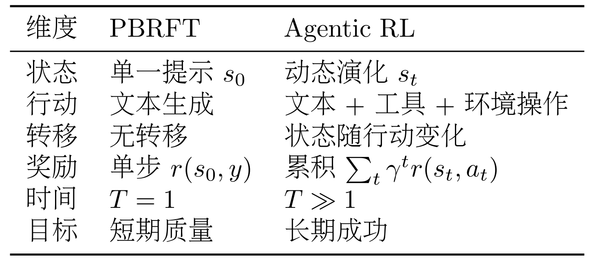

传统后训练（Preference-Based Reinforcement Fine-Tuning）和智能体强化学习对比


---
**MLA（Multi-Head Latent Attention，多头潜在注意力机制）** 是由 **DeepSeek** 团队（在 DeepSeek-V2 中首次提出）研发的一种新型注意力机制。

它的核心目标是：在显著降低推理时的显存占用（KV Cache）的同时，保持甚至超越传统多头注意力（MHA）的性能。

##### 1. 什么是 MLA？
MLA 的本质是通过 **“低秩压缩（Low-rank Compression）”** 的思想来重新设计注意力机制。

*   **核心思想**：传统的注意力机制（如 MHA/GQA）在推理时需要存储每个 Token 的 Key 和 Value。MLA 不直接存储高维的 K 和 V，而是将它们压缩成一个低维的 **“潜在向量（Latent Vector）”**。
*   **工作流程**：
    1.  **压缩**：将输入的向量投影到一个极小维度的潜在空间中。
    2.  **存储**：推理阶段，KV Cache 只存储这个极小的压缩向量。
    3.  **还原**：在计算注意力时，再通过矩阵变换将潜在向量动态还原成高维的 Q、K、V 进行运算。
*   **技术亮点**：它还解决了位置编码（RoPE）与低秩压缩冲突的问题（通过解耦 RoPE ），并利用“矩阵吸收（Matrix Absorption）”技术优化了推理速度。

##### 2. MLA vs MHA vs MQA vs GQA 的区别

为了理解 MLA，我们可以按照**“如何节省 KV 缓存”**的进化史来对比这四种机制：

| 机制名称 | 中文常用名 | 核心策略 | 优点 | 缺点 |
| :--- | :--- | :--- | :--- | :--- |
| **MHA** | 多头注意力 | 每个 Query 头对应独立的 Key 和 Value 头。 | 表达能力最强，性能最好。 | 显存消耗巨大，随序列变长极易崩坏。 |
| **MQA** | 共享多头注意力 (Multi-Query) | **所有** Query 头共享**同一组** Key 和 Value。 | 显存占用极低。 | 性能损失大（不同头关注的信息太单一）。 |
| **GQA** | 分组共享注意力 (Grouped-Query) | 将 Query 分组，**每组**共享一组 Key 和 Value。 | MHA 与 MQA 的折中，是目前 LLM（如 Llama 3）的主流。 | 仍然存在随序列增加而带来的显存压力。 |
| **MLA** | 多头潜在注意力 | **低秩压缩**。不减少头的数量，而是压缩 KV 向量的维度。 | **显存比 GQA 更低，性能接近 MHA。** | 实现复杂度最高。 |

##### 深度对比：
1.  **MQA/GQA 是“做减法”**：它们通过减少 K 和 V 的**“头数”**来省空间。比如 32 个 Q 头只配 8 个 KV 头。
2.  **MLA 是“做压缩”**：它保留了完整的“多头”表达能力，但通过数学上的低秩分解，把 KV 的**“数据量”**压缩了。
    *   **比喻**：
        *   **MHA**：每个人（Q）都有自己专属的一本书（KV）。
        *   **GQA**：几个人组成一个小组，共享一本书。
        *   **MLA**：每个人手里都拿到了所有书的“极简压缩版摘要”，看的时候再瞬间脑补出细节。


##### 3. MLA 的核心优势总结

1.  **极高的显存效率**：
    DeepSeek 的数据显示，MLA 的 KV Cache 占用仅为 MHA 的约 **1/8**（甚至更低）。这意味着在相同的显卡上，MLA 可以支持更长的上下文（Context Length）或更大的 Batch Size。
2.  **不牺牲精度**：
    传统的 MQA/GQA 这种“强行共享”头的方式往往会导致模型处理复杂逻辑时效果下降。而 MLA 通过低秩投影保留了更丰富的信息流，因此其性能远强于 GQA。
3.  **矩阵吸收优化**：
    在推理时，MLA 可以将投影矩阵提前与 Q 或 V 矩阵相乘（合并），从而在计算过程中抵消掉“还原”步骤带来的额外计算开销，使得速度非常快。

**总结一句话**：MLA 是注意力机制的一次重大架构创新，它通过**数学压缩**而非**粗暴共享**，完美解决了大模型推理中“显存占用”与“模型性能”不可兼得的难题。

---

##### langchain三层架构
langchain_core:核心抽象（Runnable、BaseParser 等）
langchain:高级工程组件（Chains / Parsers / Memory）
langchain_openai:第三方模型适配
##### langchain中大模型主要分为两类：
1.LLM（文本生成模型）
2.ChatModel（对话模型）：system负责约束整体行为，user负责当前任务，assistant负责承接和延续已经生成的内容

langchain中直接调用 llm.invoke()（如 ChatOpenAI 实例）时，返回的不是纯字符串，而是一个 AIMessage 对象。
原始返回形式：
- AIMessage 是 LangChain 中用于封装模型回复的消息类，主要包含以下属性：
- content：模型回复的文本内容（字符串）。
- additional_kwargs：模型返回的额外信息，如 OpenAI 的 finish_reason、- tool_calls 等（字典）。
- response_metadata：请求的元数据，如 token 使用量、模型名称等（字典）。
- id：消息的唯一标识符（可选）。

##### langchain中输出解析层：
1. StrOutputParser
作用：
** 避免重复代码（每个需要提取文本的地方都要写 ```.content```）使用 ```chain = llm | parser``` 后，每次 ```chain.invoke(prompt)``` 直接返回字符串，省去手动提取。
** 支持流式输出,调用 ```chain.stream()``` 时，```StrOutputParser``` 能够自动从 LLM 返回的 每个 chunk（AIMessageChunk）中提取 content 部分，而原始流式输出是复杂的消息块。手动处理流式中的 ```.content``` 需要额外代码，解析器已经内置实现。
** LangSmith 等工具可以追踪 Runnable 链中每个步骤的输入输出。如果使用 llm | parser，会清晰看到模型原始输出和解析后的字符串；如果手动取 .content，这个操作就不会被记录为独立步骤。

1. JsonOutputParser
核心是自动引导模型输出 JSON 格式，并转化为 Python 字典。
1. PydanticOutputParser
核心是通过 Pydantic 定义数据模型，解析器自动校验输出格式，不符合模型的输出会直接报错，提前规避风险。

##### LCEL（LangChain Expression Language）架构
LCEL（LangChain Expression Language）是 LangChain 的核心表达式语言，用管道符``` | ```把组件串成流水线，前一个组件的输出自动作为后一个的输入，就像工厂的生产线。

##### Memory组件：
| 全量记忆 | 短对话、需要完整上下文的场景（如一对一咨询）
| 窗口记忆 | 中长对话、对早期信息要求不高的场景（如闲聊）
| 摘要记忆 | 超长对话、需要平衡上下文与效率的场景（如客服、长期协作）
支持多会话隔离（通过session_id）、自动管理历史消息的注入与保存、适配现代LLM模型的会话交互逻辑。

##### Tool组件
| Tool | 具体的“干活工具”，比如查询天气的工具、读文件的工具。每个工具都有明确的名称和描述（AI就是通过描述知道该用哪个工具的）；
| Toolkit | 把相关的工具打包在一起，比如“文件操作工具包”里包含读文件、写文件、列目录三个工具；
| Agent | 团队的“指挥官”，负责协调LLM和工具——判断要不要调用工具、用哪个工具、怎么处理工具返回的结果。

##### Runnables组件
| 组件 | 核心逻辑 | 适用场景 |
| ---- | ---- | ---- |
| RunnableSequence(线性流转) | 多个组件按固定顺序执行，前一个组件的输出作为后一个组件的输入；支持 | 运算符或 from_chain() 创建，提供 .invoke() / .stream() / .batch() 方法，可搭配 RunnablePassthrough 实现多输入传递 | 流水线式任务，如"提取信息→生成摘要→翻译"等多步骤顺序处理
| RunnableBranch(动态路由) | 根据输入内容或条件进行判断，将请求动态分发到不同处理分支 | 多场景路由任务，如智能客服（订单问题 / 售后问题）、多主题问答（历史 / 科技 / 医疗）
| RunnableParallel / RunnableMap | 对同一输入并行执行多个子组件，最终返回结构化结果（dict） | 多维度分析任务，如从“情感、逻辑、文采”等多个角度评价同一文本
| RunnableLambda | LangChain 中用于将任意自定义函数 / 逻辑包装成 Runnable 接口的组件，让普通函数可以无缝接入 LangChain 的链式调用体系中。简单来说，它就是「普通函数」和「LangChain 可运行组件」之间的「适配器」 | 示例：extract_sell_points = RunnableLambda(lambda msg: {"sell_points": msg.content}) |
---
#### langgraph
- 支持状态管理、复杂流程管控和多智能体协作
- 核心价值：显式控制、可预测性、精细调控
**三大组件**：状态、节点、边
##### 状态传递机制：
工作流启动时初始化状态，每个节点执行时接收当前状态，处理后返回需要更新的字段，LangGraph会根据**合并策略**更新全局状态，再传递给下一个节点。**注意**：节点返回的字典只需包含要更新的字段，无需返回完整状态。比如节点只更新progress字段，就返回{"progress": 1}，LangGraph会自动合并到全局状态中。
LangGraph 采用这**增量更新**而非**覆盖更新**的设计，主要基于以下四个核心原因：
1. **解耦与单一职责原则** (Decoupling)
在复杂的图中，一个节点通常只负责一项具体的任务。
*   **场景**：假设你的状态（State）里有 10 个字段，其中一个是 `tool_result`，一个是 `final_answer`。
*   **逻辑**：执行工具调用的节点只关心 `tool_result`。如果它必须返回完整状态，它就必须先读取并保存它不关心的其他 9 个字段（比如用户原始查询、进度条、之前的历史记录等），然后再原样传回去。
*   **好处**：节点只需要知道自己要改变什么。这使得节点更纯粹、更易于复用和维护。

2. **性能与效率** (Efficiency)
状态可能非常庞大，特别是当对话历史（`messages`）包含几十轮对话或者大段文档时。
*   **内存压力**：如果每个节点都完整复制一遍几百 KB 的状态并返回，在长路径的图中，内存开销和数据序列化的时间会显著增加。
*   **增量传输**：只返回 `{"progress": 1}` 意味着只有几个字节的数据在内存中传递和合并，极大地提高了系统响应速度。

3. **并行执行与竞态条件处理** (Concurrency)
这是 LangGraph 区别于简单线性链的核心点。在图中，**两个节点可能在同时运行**（并行分支）。
*   **冲突风险**：如果节点 A 和节点 B 同时运行，且都返回“完整状态”：
    *   节点 A 修改了字段 `a`，返回了全量状态。
    *   节点 B 修改了字段 `b`，返回了全量状态。
    *   **结果**：后返回的那个节点会把先返回的那个节点所做的修改**彻底覆盖掉**（因为后者的完整状态里还留着旧的 `a` 或 `b`）。
*   **解决逻辑**：如果它们都只返回自己更新的字段（A 返回 `{"a": 1}`，B 返回 `{"b": 2}`），LangGraph 就可以安全地将这两个增量合并到全局状态中，互不干扰。

4. **强大的“Reducer”合并机制** (The Reducer Pattern)
*   **场景**：状态里的 `messages` 字段。
*   **操作**：节点返回 `{"messages": [新消息]}`。
*   **合并逻辑**：由于我们在定义状态时使用了 `Annotated[list, add_messages]`，LangGraph 知道：**“哦，这不代表我要把旧列表换成这个新列表，而是要把新消息追加进去。”**
*   **优势**：如果要求返回完整状态，节点就得自己手动做 `old_list + [new_msg]` 的逻辑，这不仅麻烦，还容易出错（比如不小心弄丢了历史记录）。

##### 节点：
节点（Node）是 AI 工作流的最小执行单元，负责完成具体计算任务，如调用大模型、调用外部工具或进行数据处理。每个节点遵循“读取状态 → 执行逻辑 → 返回状态更新”的工作模式，本质上是一个以状态为输入、以状态补丁为输出的纯函数。
**注意**：节点只能通过状态与其他节点交互，禁止直接调用其他节点函数，确保流程的可追溯性。

##### 边：
边的类型：固定边、条件边、循环边（特殊的条件边）

##### 人机协作机制
* **检查点与状态持久化**：
  多智能体工作流运行过程中，保存每一步的状态（比如每个节点的输出、当前进度），如果程序崩溃、中断，下次可以直接从保存的进度继续运行，不用从头再来——这就是“状态持久化”，LangGraph 提供了**MemorySaver**工具。

* **中断机制**：
  工作流运行到某个关键节点（比如转账、发邮件、发布内容）时，自动中断，等待人工授权/确认后，再继续执行——防止智能体误操作，保障流程安全。LangGraph提供了**interrupt_before**（先中断询问再执行）和**interrupt_after**（先执行再终端询问）参数，专门实现中断机制。

* **动态状态编辑**：
  工作流运行过程中，人工可以干预并修改智能体的中间输出（比如情节设计Agent写的情节有错误，人工直接修改），或者将工作流回退到之前的某个节点（比如审批驳回后，回退到任务执行节点重新执行）——这就是动态状态编辑，LangGraph 可以通过修改checkpoint的state实现。

---

#### Openclaw
1. 核心：基于ReAct思想
2. 提示词系统： 用一组工作区markdown文件定义：本身，用户，工作流程，工具，长期记忆，定时任务清单，初始化引导，名字、头像等基础身份
- Openclaw工作区：身份层、行为层、记忆层、生命周期层、能力层

3. 工具系统：读取read、创建write、修改edit、执行execute
4. 消息系统： 泳道模型、心跳机制、分层容错
5. 统一网关： 
6. 安全沙箱： 
---
#### RAG流程
**RAG 的核心在于将 LLM 的内在参数化知识与外部非参数化知识相结合**
- 文档加载 -> 文本分割 -> 向量存储与嵌入 -> 检索 -> 生成
##### 文本分割
- 相关性原则
- 大小适中原则：文本块的大小必须小于等于嵌入模型的上下文窗口
- 常见分割策略：
  下面是基于`Langchain`的分块策略 
  -  langchain官方```RecursiveCharacterTextSplitter```通过**分层分隔符优先级**实现语义感知分割，先按大分隔符（如空行）拆分段落，再按小分隔符（如句号、逗号）微调，直到片段长度符合要求，最大程度保证语义完整性。适配TXT、Markdown、PDF等绝大多数文本类型。
  -  ```CharacterTextSplitter```（按字符数分割）仅适用于结构极简单的文本（如纯文本日志），LangChain不推荐作为默认方案。核心优势是轻量、速度快，需手动保证语义完整性。
  -  **语义分块**：LangChain 提供了 ```langchain_experimental.text_splitter.SemanticChunker```
     - 句子分割：使用标准的句子分割规则（例如，基于句号、问号、感叹号）将输入文本拆分成一个句子列表。
     - 上下文感知嵌入
     - 计算语义距离: 计算每对相邻句子的嵌入向量之间的余弦距离。这个距离值量化了两个句子之间的语义差异——距离越大，表示语义关联越弱，跳跃越明显。
     - 识别断点: ```SemanticChunker``` 会分析所有计算出的距离值，并根据一个统计方法（默认为 ```percentile```）来确定一个动态阈值
     - 合并成块: 最后，根据识别出的所有断点位置，将原始的句子序列进行切分，并将每个切分后的部分内的所有句子合并起来，形成一个最终的、语义连贯的文本块。
     - **断点识别方法**:
     1. percentile (百分位法 - 默认方法): 计算所有相邻句子的语义差异值，并将这些差异值进行排序。当一个差异值超过某个百分位阈值时，就认为该差异值是一个断点。
     2. standard_deviation (标准差法): 计算所有差异值的平均值和标准差。当一个差异值超过“平均值 + N * 标准差”时，被视为异常高的跳跃，即断点。
     3. interquartile (四分位距法): 使用统计学中的四分位距（IQR）来识别异常值。当一个差异值超过 Q3 + N * IQR 时，被视为断点
     4. gradient (梯度法): 首先计算差异值的变化率（梯度），然后对梯度应用百分位法。对于那些句子间语义联系紧密、差异值普遍较低的文本（如法律、医疗文档）特别有效，因为这种方法能更好地捕捉到语义变化的“拐点”。
  - 基于文档结构分块：于具有明确结构标记的文档格式（如Markdown、HTML、LaTex），可以利用这些标记来实现更智能、更符合逻辑的分割。
    
##### 向量嵌入与存储
- **嵌入模型**: 核心通常是 Transformer 的编码器（Encoder）部分。嵌入模型训练效果增强策略：`度量学习`、`对比学习`
  工作流程：
  - 分词：将输入的文本块分解成一个个 token。
  - 向量化：每个 token 生成一个高维向量表示。
  - 池化：通过某种方法（如取 [CLS] 位的向量、对所有token向量求平均 mean pooling 等），将所有 token 的向量压缩成一个单一的向量，这个向量代表了整个文本块的语义。
- **多模态嵌入**：`CLIP模型`采用**双编码器架构 (Dual-Encoder Architecture)**，包含一个图像编码器和一个文本编码器，分别将图像和文本映射到同一个共享的向量空间中。
- **向量数据库选择**： FAISS、Chroma、Pinecone、Milvus、Qdrant
```FAISS```本质上是一个算法库，它将索引直接保存为本地文件（一个 .faiss 索引文件和一个 .pkl 映射文件），而非运行一个数据库服务。
- **向量数据库通常采用四层架构**：
  通过存储层、索引层、查询层和服务层的协同工作来实现高效相似性搜索，
  **存储层**负责存储向量数据和元数据，优化存储效率并支持分布式存储；
  **索引层**维护索引算法（HNSW、LSH、PQ等），负责索引的创建与优化，并支持索引调整；
  **查询层**处理查询请求，支持混合查询并实现查询优化；
  **服务层**管理客户端连接，提供监控和日志能力，并实现安全管理
向量数据库与传统数据库的主要差异如下：

| 维度 | 向量数据库 | 传统数据库 |
| --- | --- | --- |
| 核心数据类型 | 高维向量 (Embeddings) | 结构化数据 (文本、数字、日期) |
| 查询方式 | 相似性搜索 (ANN) | 精确匹配 |
| 索引机制 | HNSW, IVF, LSH 等 ANN 索引 | B-Tree, Hash Index |
| 主要应用场景 | AI 应用、RAG、推荐系统、图像/语音识别 | 业务系统 (ERP, CRM)、金融交易、数据报表 |
| 性能特点 | 高维数据检索性能极高，计算密集型 | 结构化数据查询快，高维数据查询性能呈指数级下降 |
| 一致性| 通常为最终一致性 | 强一致性 (ACID 事务) |

- **Milvus组件**
   - 集合（Collection）： Schema 规定了 Collection 的数据结构，定义了其中包含的所有字段 (Field) 及其属性。一个设计良好的 Schema 是能够保证数据一致性并提升查询性能。
      - schema通常包含：
   **主键字段** (Primary Key Field)：每个 Collection 必须有且仅有一个主键字段，用于唯一标识每一条数据（实体）。它的值必须是唯一的，通常是整数或字符串类型。
   **向量字段** (Vector Field)：用于存储核心的向量数据。一个 Collection 可以有一个或多个向量字段，以满足多模态等复杂场景的需求。
   **标量字段** (Scalar Field)：用于存储除向量之外的元数据，如字符串、数字、布尔值、JSON 等。这些字段可以用于过滤查询，实现更精确的检索。
      - 分区：提升查询性能: 在查询时，可以指定只在一个或几个分区内进行搜索，从而大幅减少需要扫描的数据量，显著提升检索速度。
      - 别名：安全地更新数据，更新新的 Collection 时，只要切换 Alias 指向，用户完全感觉不到系统在后台换了数据库。
  
   - 索引：
      - 标量字段索引：主要用于加速元数据过滤，常用的有 `INVERTED、BITMAP` 等。通常使用推荐的索引类型即可。
      - 向量字段索引：这是 Milvus 的核心。选择合适的向量索引是在查询性能、召回率和内存占用之间做出权衡的艺术。
      - **索引算法**：FLAT (精确查找)、IVF 系列 (倒排文件索引)、HNSW (基于图的索引)、DiskANN (基于磁盘的索引)
  
   - 检索: 
      - 基础向量检索：近似最近邻 (Approximate Nearest Neighbor, ANN) 检索
      - 增强检索：1. 过滤检索 (Filtered Search) 2. 范围检索 (Range Search) 3. 多向量混合检索 (Hybrid Search) 4. 分组检索 (Grouping Search)


##### 检索器配置与检索策略优化
langchain中检索器：
- 基础检索器FAISSRetriever，直接从FAISS向量数据库创建检索器，最基础的检索方式，支持**相似性检索**。相似性检索（Similarity Search）可能会有一个问题：检索到的片段内容太相似，导致信息冗余。
- **MMR检索** （Maximum Marginal Relevance，最大边际相关性）检索能解决这个问题——在保证相关性的同时，尽量选择多样化的片段，避免冗余。

检索优化：
- **混合检索** ： **BGE-M3** 作为向量生成器，它能够同时生成稀疏向量和密集向量。
    - RRF（倒数排序融合）：不关心不同检索系统的原始得分，只关心每个文档在各自结果集中的排名
    - 加权线性融合：需要先将**不同检索系统**的得分进行归一化（例如，统一到 0-1 区间），然后通过一个权重参数 $\alpha$ 来进行线性组合
- **查询重构与分发**：
  - 查询翻译：目标是弥合用户自然语言提问与文档库中存储信息之间的“语义鸿沟”。通过重写、分解或扩展查询，显著提升检索的准确率。
     - 提示工程
     - 多查询分解：langchain提供`MultiQueryRetriever`实现
     - 退步提示
     - 假设性文档嵌入
  - 查询路由： 当系统接入了多个不同的数据源或具备多种处理能力时，就需要一个“智能调度中心”来分析用户的查询，并动态选择最合适的处理路径。其本质是替代硬编码规则，通过语义理解将查询分发至最匹配的数据源、处理组件或提示模板，从而提升系统的效率与答案的准确性。
    - 基于llm意图识别
    - 嵌入相似性路由
  

##### RAG系统常见问题与优化方向
RAG评估三元组：上下文相关性、忠实度/可信度（关注模型是否遵守上下文）、答案相关性（关注模型是否有效回答了问题）


**评估常用工具**：
    1. LlamaIndex框架的`LlamaIndex Evaluation`模块.
    2. RAGAS: 一个独立的、专注于RAG的开源评估框架
    3. Phoenix 

##### RAG 系统的评估与调优方法
评估核心指标：相关性、准确性、响应速度
| 指标 | 定义 | 衡量标准 | 优化目标 |
| ---- | ---- | ---- | ---- | 
| 相关性（Retrieval Relevance） | 检索器返回的文本片段与用户问题的语义关联程度 | **1**. 精确率（Precision）：检索到的相关片段数 / 检索到的总片段数； **2**. 召回率（Recall）：检索到的相关片段数 / 知识库中所有相关片段数； **3**. F1分数：2×(精确率×召回率)/(精确率+召回率)（综合精确率和召回率） | F1分数≥0.8，确保检索结果“既准又全” | 
| 准确性（Generation Accuracy） | 大模型生成的答案与参考资料（检索片段）的一致性、事实正确性 | **1**. 事实一致性（Factuality）：人工或自动化工具判断答案是否符合检索片段中的事实； **2**. 信息完整性（Completeness）：答案是否覆盖用户问题所需的所有核心信息； **3**. 错误率：包含编造信息、错误关联的答案占比 | 事实一致性≥95%，错误率≤5%，核心信息覆盖率≥90% | 
| 响应速度（Response Speed） | 用户发起提问到获取最终答案的总耗时，含检索耗时和生成耗时 | **1**. 检索耗时：从接收问题到获取相关片段的时间； **2**. 生成耗时：从传入检索片段到生成最终答案的时间； **3**. 总耗时=检索耗时+生成耗时 | 总耗时≤2秒（普通问答场景），≤5秒（复杂文档问答场景） | 

1. 检索优化：引入“混合检索”（相似性检索+关键词检索），结合语义相关性和关键词匹配，提升检索精度；使用“检索重排”（如Cross-Encoder），对初步检索结果重新排序，筛选出最相关的片段。
2. 提示词工程优化：采用“思维链（CoT）”提示词，引导大模型逐步分析参考资料、生成答案；针对特定行业（如医疗、法律）定制领域专属提示词模板，提升答案专业性。
3. 知识库优化：建立知识库更新机制（定期添加新文档、删除过期文档）；对文档进行预处理（清洗冗余信息、标注核心知识点），提升文本分割和嵌入的效果。

##### Text2SQL
问题：1. 幻觉问题。 2. 对数据库结构理解不足。 3. 处理用户输入的模糊性
**优化策略**：
- 提供精确的数据库模式
- 提供少量高质量的示例
- 利用RAG增强上下文
- 错误修正与反思

##### 高级RAG架构
**GrapgRAG**：GraphRAG将检索的目标从独立的文本片段转变为在知识图谱中寻找相关的实体、关系、路径或子图。
通用架构三阶段：
- 知识图谱构建
- 图谱检索
- 增强生成 

**LightRAG**
**FRAG (Flexible RAG)**
**GraphIRAG (Iterative Knowledge Retrieval)**

---
#### 知识图谱（Knowledge Graph, KG）
主要由两个要素构成： 1. 节点。 2. 边。
基本结构可以表示为一个三元组：` (实体) - [关系] -> (实体) ` 
相比`llm`优势：在许多垂直领域，基于知识图谱的问答系统（KBQA）因其答案的准确性和可解释性。

##### 知识图谱的构建
传统构建过程依赖于两种 NLP 技术： 
- 命名实体识别： 抽取的实体是知识图谱中的**节点**
- 关系抽取： 判断出的实体间的关系，成为连接两个节点的**边**

##### GraphRAG的诞生
- **llm的局限性与挑战**：完全依赖 LLM 会面临成本高昂、数据隐私（使用闭源 API 时）、以及“幻觉”问题，即模型可能会编造事实。
- **GraphRAG**：为了结合知识图谱的准确性和大模型的推理能力，微软提出了 GraphRAG。原理是将知识图谱作为一个可靠、可随时更新的**外部知识库**，并基于图结构进行**子图检索**（如社区发现、路径搜索等），而非检索孤立事实。工作流程
  - 利用大模型从问题中识别出核心实体与约束
  - 在图中检索与之高度相关的子图，获得准确且可解释的事实与关系。
  - 将该子图的结构化信息作为上下文，连同原始问题一起输入给大语言模型，生成基于证据的答案。

##### Neo4j(图数据库)
Neo4j数据模型：
- 节点： 节点是图中的基本数据单元
- 标签： 用于为节点分类或打上“类型”标记。一个节点可以拥有一个或多个标签。
- 关系： 定义了节点之间的联系
  - 有方向
  - 有类型
  - 属性（可有） 
- 属性： 以键值对（Key-Value）形式存储在节点和关系上的详细信息。

**查询语言**：**Cypher**

---

#### Agent Skill
skill是一个渐进式披露结构
- 元数据层（名称、描述） 始终加载
- 指令层（SKILL.md中除了名称和描述以外的内容） 按需加载
- 资源层（Reference、Script） Reference是被读取的，需要读取才会放到大模型上下文中；Script是被执行的，大多数情况模型不会去看源代码，只会看执行结果


---

#### 程序、进程、线程、内存
运行一个程序时是将可执行文件加载到内存中，此时程序变成了一个进程，操作系统负责分配进程执行需要的额外的内存来存储用户的输入和临时结果，分配给进程的内存叫**进程的地址空间**，一个进程可能还有一组打开的文件以及分配给它的输入输出设备。因此进程不是程序本身，而是程序运行的完整上下文环境。
每次进程中断时，系统会捕获该进程的CPU状态并恢复另一个进程的状态，这种执行的操作就是**上下文切换**
通过 **PCB(进程控制块)** 来管理进程，每个进程都有唯一标识符，也就是进程的ID（pid）,操作系统必须跟踪分配给每个进程的所有内存块。

进程间通信（IPC）有两个基本模型：**共享内存** 和 **消息传递**
常见的消息传递机制包括：**管道、套接字、远程过程调用**
客户端-服务器架构通常使用**套接字**接口实现。
消息传递缺点： 由于端口在内核的地址空间中，因此进程每次发送或者接收消息时都必须使用系统调用，性能方面代价高昂。共享内存则没有此限制，只是在分配共享内存时有系统调用，所以通信很快，但绝大多数情况消息传递够用。

通过不再将每个进程限制为一个程序计数器，可以在需要同一进程内的代码并发运行时创建一个新**线程**，每个线程都拥有自己独立的栈，但其它线程也能访问，因为它们都属于一个进程，线程不是一个函数，线程通过程序计数器指向代码。

---
#### MCP、CLI和function call的区别

在AI（特别是大语言模型和Agent开发）的语境下，**MCP（模型上下文协议）**、**CLI（命令行界面）**和**Function Call（函数调用）**是三个不同层面的概念。它们分别代表了**架构协议**、**交互环境**和**模型能力**。

虽然它们常在开发AI Agent时被结合使用，但定位和优缺点有显著差异。以下是详细的对比和解析：

##### 1. Function Call (函数调用)
**定义**：它是大语言模型（如GPT-4, Claude 3）的一种**原生能力**。开发者在提示词中告诉AI有哪些函数（工具）可用，AI通过语义理解，在需要时输出一段结构化的JSON数据，指示应用程序去执行某个特定的函数，并传入相应的参数。

**在AI中的角色**：它是AI与外部世界交互的“大脑决策机制”。

*   **优点**：
    *   **结构化输出**：AI输出严格的JSON格式，非常容易与代码集成，无需复杂的正则提取。
    *   **确定性与精确性**：开发者可以精确定义函数的输入参数类型和必填项，降低AI的幻觉。
    *   **高度灵活**：你可以将任何后端逻辑（查天气、订机票、查数据库）包装成Function让AI调用。
*   **缺点**：
    *   **各自为战（缺乏标准化）**：不同平台的应用需要重复编写“胶水代码”来对接相同的工具（例如，给ChatGPT写一套插件，给Claude又得重新写一套）。
    *   **上下文窗口限制**：如果你有几百个工具，把所有工具的描述都塞给AI，会消耗大量Token，且会导致模型注意力分散、调用准确率下降。
    *   **本身不能执行**：Function Call只负责“生成调用指令”，真正的执行逻辑需要开发者自己在后端代码中实现。

##### 2. MCP (Model Context Protocol / 模型上下文协议)
**定义**：由Anthropic（Claude的开发商）在2024年底推出的一个**开源标准协议**。它的目标是统一AI模型连接外部数据源和工具的方式。它就像AI界的“USB-C接口”。

**在AI中的角色**：它是连接AI（客户端）和各种数据源/工具（服务器端）的“标准化桥梁”。

*   **优点**：
    *   **一次编写，到处使用**：你只需编写一个 MCP Server（例如GitHub MCP或数据库MCP），任何支持MCP的AI客户端（如Claude Desktop、Cursor等）都可以直接接入使用，消除了N对M的重复开发问题。
    *   **关注点分离**：MCP将“工具的实现逻辑”和“AI的调用逻辑”解耦。模型侧只需懂MCP协议，不需要关心底层是查SQL还是调API。
    *   **安全性与本地控制**：MCP Server通常在本地或私有环境中运行，用户可以精确控制AI能访问哪些本地文件或数据，不用把敏感数据上传到云端。
*   **缺点**：
    *   **架构复杂度增加**：引入了Client-Server架构。对于非常简单的任务，直接写个Function Call比搭建一套MCP Server要容易得多。
    *   **生态还在早期**：虽然发展迅速，但并非所有的AI工具和模型平台目前都完全原生支持MCP标准。


##### 3. CLI (Command Line Interface / 命令行界面)
**定义**：传统的计算机交互界面，用户（或AI）通过输入文本命令（如 `ls`, `git commit`, `python run.py`）来操作操作系统。

**在AI中的角色**：在AI Agent（如Devin, Aider, AutoGPT）中，CLI通常作为**提供给AI的最强大的“超级工具”**。AI通过生成Shell命令并在沙箱/终端中执行，来完成写代码、运行测试、管理文件等任务。

*   **优点**：
    *   **无与伦比的强大与通用性**：人类能在终端里做的事情，只要赋予AI CLI权限，它都能做。无需为“读文件”、“写文件”、“运行Git”分别写几十个复杂的API，直接给一个CLI环境即可。
    *   **最适合程序员AI**：现在的代码Agent高度依赖CLI来验证代码（运行 `npm run test`）并自我修复。
*   **缺点**：
    *   **极度危险**：让AI拥有CLI权限等于把电脑的控制权交出。如果AI产生幻觉或被恶意提示词注入（Prompt Injection），可能会执行 `rm -rf /` 或泄露系统机密。必须在严格隔离的沙箱（Docker等）中运行。
    *   **非结构化输出**：CLI命令的执行结果（stdout/stderr）是纯文本，长短不一且格式各异。AI需要具备很强的长文本理解能力才能从报错信息中找出问题，不如JSON结构化数据好处理。
    *   **容错率低**：命令敲错一个字符可能导致程序崩溃，甚至阻塞终端（比如触发了需要交互输入的命令），需要做大量复杂的终端环境适配。


##### 💡 总结与它们之间的关系

这三者并不是互斥的，在现代高级AI Agent中，它们经常是**嵌套使用**的：

1.  **Function Call** 是最基础的能力。
2.  为了不让开发者重复写代码，业界搞出了 **MCP**。
3.  MCP 的底层实现，其实依然是把工具打包成 **Function Call** 喂给大模型。
4.  而我们写的一个 MCP Server 或提供的一个 Function，其内部功能可能就是给大模型提供一个 **CLI** 终端，让大模型能执行 Shell 命令。

**如何选择？**
*   如果你在开发一个**独立的内部小应用**，只需要调两个API（比如发钉钉消息、查天气），直接用 **Function Call**。
*   如果你想开发一个**工具库**，希望它能同时被 Claude Desktop、Cursor、Dify 等各种不同的 AI 平台无缝集成，你应该开发一个 **MCP Server**。
*   如果你在开发一个**自动写代码的超级AI Agent**，你需要赋予模型操作 **CLI** 的能力，但一定要记得加上沙箱隔离策咯。

---
#### MCP

要深入理解 MCP（Model Context Protocol，模型上下文协议），我们需要从它的**核心组件**、**通信机制**和**调用流程**三个维度来解剖。

MCP 的设计哲学非常克制和清晰，它本质上是一个**基于 JSON-RPC 的微服务架构标准**。以下是详细解析：

##### 一、 核心组件 (Core Components)

MCP 的架构包含“网络拓扑角色”和“功能定义原语”两个层面的组件。

##### 1. 网络拓扑角色（三大核心实体）
*   **MCP Host (宿主应用)**：直接面向用户的应用程序（比如 Claude Desktop、Cursor IDE、Dify）。它负责接收用户的输入，并与远端的大语言模型（LLM）通信。
*   **MCP Client (客户端)**：运行在 Host 内部的协议引擎。它负责维持与各个下游 Server 的连接，充当大模型与外部工具之间的路由器。
*   **MCP Server (服务端)**：一个极其轻量级的桥梁程序。它连接着真正的外部系统（如本地数据库、GitHub、Slack、文件系统），并将这些系统独有的 API 翻译成符合 MCP 标准的数据格式。

##### 2. 功能定义原语（服务端向客户端提供的三大能力）
MCP 规定 Server 只能通过以下三种标准化形式暴露能力：
*   **Resources (资源)**：以类似 `URI`（如 `file:///logs/app.log`）格式暴露的、供大模型读取的静态或动态数据。**（提供上下文）**
*   **Tools (工具)**：带有明确 JSON Schema 参数定义的函数（如 `query_db(sql)`），大模型可以决定何时调用它们以改变外部状态或获取动态计算结果。**（提供执行力）**
*   **Prompts (提示词模板)**：Server 提供的一些预置工作流模板，供 Host 作为 UI 菜单展示给用户或自动触发。**（提供标准化流程）**

##### 二、 通信机制 (Communication Mechanism)

MCP 的通信机制设计得非常巧妙，兼顾了**本地高安全性**和**云端高扩展性**。

##### 1. 基础协议：JSON-RPC 2.0
MCP 所有的消息往来（请求 Request、响应 Response、通知 Notification）全部采用标准的 JSON-RPC 2.0 格式。它不关心底层用的什么网络，只要能传 JSON 字符串就能跑。

##### 2. 双重传输层 (Transports)
为了适应不同的部署场景，MCP 官方目前定义了两种标准的传输方式：

*   **① stdio (标准输入输出) —— 主打“本地绝对安全”**
    *   **原理**：Client 作为父进程，直接把 Server 作为一个子进程启动（比如运行 `node mcp-server.js`）。两者之间不走网络端口，而是通过操作系统的 `stdin` 和 `stdout`（标准输入和输出）来传递 JSON 字符串。
    *   **优点**：**不需要开放任何网络端口**，不会与本地其他服务冲突；完全隔离在本地计算机上，外部黑客无法通过网络直接攻击 MCP Server，安全性极高（目前的 Claude Desktop 连本地文件主要用此模式）。
*   **② SSE (Server-Sent Events over HTTP) —— 主打“远程云端连接”**
    *   **原理**：Server 部署在远端服务器上。Client 通过 HTTP POST 发送请求，Server 通过 SSE（服务器推送事件）保持单向长连接，实时把 JSON 数据推回给 Client。
    *   **优点**：适合 SaaS 平台（如连接企业内部的私有云数据库），允许 AI 跨越公网与远程服务器进行安全认证的通信。

##### 三、 调用流程 (Execution Flow)

我们可以把 MCP 的工作流程分为两个阶段：**初始化握手**和**交互执行**。

我们以**“在 Cursor (MCP Host) 中让大模型查询本地 SQLite 数据库 (MCP Server)”**为例：

##### 阶段一：初始化握手 (Initialization/Handshake)
当宿主应用（Cursor）启动时，幕后的连线就开始了。

1.  **启动连接**：Cursor (Client) 通过 `stdio` 启动本地的 SQLite Server 进程。
2.  **能力互换 (Initialize Request/Response)**：
    *   Client 发送消息给 Server：“我是 Cursor，我支持让模型调用工具（Tools）。”
    *   Server 回复 Client：“我是 SQLite Server。我拥有一个名为 `execute_sql` 的 Tool，它的参数需要一个 `query` 字符串。”
3.  **列表同步**：Client 把这些 Tools 的定义缓存到本地，准备随时提供给大语言模型。

##### 阶段二：交互执行 (Interaction Loop)
当用户开始提问时，真正的调用大戏开始：

1.  **用户输入**：用户在 Cursor 聊天框输入：“帮我查一下数据库里用户总数。”
2.  **组装 Prompt**：Cursor (Host) 将用户的提问，**连同刚才获取到的 `execute_sql` 的工具定义（JSON Schema）**，一起打包发给云端的大模型（如 GPT-4o 或 Claude 3.5）。
3.  **模型推理 (Function Call)**：大模型收到 Prompt，分析后发现自己没法直接回答，但发现有 `execute_sql` 这个工具可用。于是大模型返回一段特殊的 JSON（Function Call 指令），告诉 Cursor：“我要调用 `execute_sql`，参数是 `SELECT COUNT(*) FROM users;`”。
4.  **Client 路由与请求 (Call Tool Request)**：Cursor (Client) 截获这条指令，将其封装成 MCP 标准的 `CallTool` 请求，通过 `stdio` 发送给本地的 SQLite Server。
5.  **Server 执行任务**：SQLite Server 收到请求，解析出 SQL 语句，真正在本地执行数据库查询。
6.  **Server 返回结果**：SQLite Server 把查询结果（例如 `[{"COUNT(*)": 150}]`）打包成 JSON，通过 `stdio` 返回给 Client。
7.  **结果反馈给模型**：Cursor 把这个结果作为“工具调用结果 (Tool Result)”的上下文，再次发送给云端大模型。
8.  **最终输出**：大模型结合得到的数据，生成最终的自然语言回答：“经过查询，您的数据库中共有 150 名用户。”并展示给用户。

##### 💡 核心总结

*   **组件**：Host/Client 是调度中心（如IDE或聊天客户端），Server 是外包干活的（如数据库桥接器），Tools/Resources 是交流的业务接口。
*   **通信**：基于 JSON-RPC 2.0，本地用安全的 `stdio` 进程间通信，远程用 `SSE` 网络通信。
*   **流程**：握手感知能力 -> 大模型决定调用工具 -> Client 转发请求给 Server -> Server 执行并返回数据 -> 大模型总结结果。

MCP 协议的巧妙之处在于，**大模型永远不直接和数据库或外部系统连接**。MCP Client 作为极其尽职的中间人，完美地隔离了“AI的聪明大脑（云端）”和“企业的敏感数据资产（本地服务端）”。

---

`langchain`提供的`SelfQueryRetriever`不能进行排序查询

`continue learning` 和 `context management`本质没太大区别，`continue learning`是改变模型权重，`context management`不会改变模型权重，但`context`里面词的`KV`也算是一种权重。


