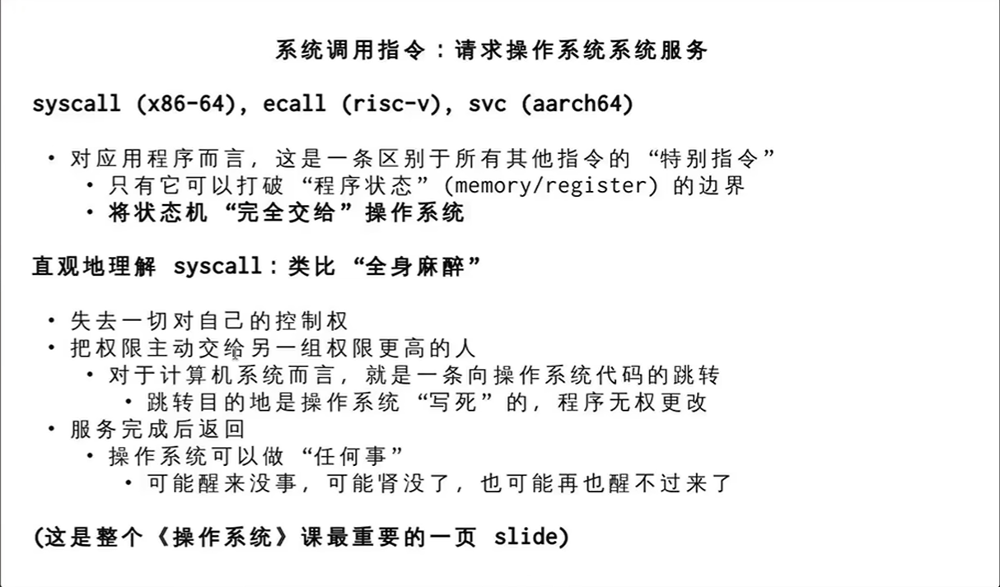

1. 程序的真正起点从来不是 main 函数
平时我们写代码（无论是 C 还是 Java），都习惯性地认为程序是从 main 函数开始执行的。但实际上，当操作系统加载一个可执行文件时，它寻找的入口点并不是 main，而是一个叫做 _start 的符号。

在正常情况下，编译器会默默地在你的代码外面包上一层 C 标准库（libc）的代码。也就是 _start 函数先执行，它负责准备好运行环境（比如初始化栈、解析命令行参数 argc 和 argv 等），然后再由它去调用你的 main 函数。

在这节课里，JYY 老师为了彻底看清单纯的“机器”是如何工作的，做了一个违背常规的操作：抛弃标准库，自己裸写程序的入口。

2. 夺取控制权：裸写 _start
老师在代码里直接定义了 _start，并加上了特殊的编译选项（比如不链接标准库），强行让操作系统把控制权第一步就交给他写的代码。

代码跑起来了，也确实输出了想要的结果，但紧接着就发生了一个诡异的现象：程序结束时崩溃了，报了 Segmentation fault（段错误）。

为什么一段没有任何逻辑错误的极简代码，会在结束时崩溃？这就是最精彩的第三步。

3. 无情的指令执行机器与 Segfault 的真相
在计算机系统的底层，CPU 只是一个“无情的执行指令的机器”。它没有“程序结束了”这个高级概念，它只会机械地看程序计数器（PC / RIP 寄存器）指向哪里，就去哪里取指令执行。

当我们在普通的 C 函数里写 return 时，底层对应的汇编指令是 ret。ret 指令的微观操作非常机械：把当前栈顶（Stack Pointer 指向的内存空间）里的那串数字弹出来，塞进 PC（程序计数器）里，然后 CPU 就跳转到这个地址去接着执行。

普通函数调用时：栈顶正好存着当初调用它时的“返回地址”，所以 ret 能完美回家。

在我们的极简 _start 里：这是程序的最开端！此时的栈底根本没有合法的返回地址，栈顶存放的可能是命令行参数的数量（argc，比如数字 1）。

灾难发生：ret 指令无情地把 1 塞进了程序计数器。CPU 傻乎乎地跑到内存地址 0x00000001 去找指令执行，而这个地址属于操作系统的受保护禁区或根本未映射的内存，于是直接被操作系统一脚踢死——Segmentation fault。

4. 正确的退出姿势：向“上帝”求助 (System Call)
通过上面的崩溃，我们明白了一个深刻的道理：在用户态的程序里，你哪怕走到了代码的最后一行，也没有能力“杀死”自己。

要想体面地、不报错地退出，程序必须利用系统调用（System Call）。系统调用就像是程序和操作系统（上帝）之间约定的“契约”。
在 x86-64 架构下，正确的退出机制是：

把数字 60（代表 sys_exit 系统调用的编号）放到特定的寄存器（rax）里。

把你想返回的退出码（比如 0）放到另一个寄存器（rdi）里。

执行一条特殊的汇编指令 syscall。

一旦执行 syscall，世界暂停，操作系统接管一切，干脆利落地把这个进程清理掉，程序这才得以善终。普通程序里写的 return 0; 或 exit(0);，本质上都是标准库在底层偷偷帮你封装好了这段 syscall 的过程。

总结来说：
这个演示剥离了所有高级语言的岁月静好，让你直视底层的残酷真相——代码就是状态机，CPU 只管盲目向前执行。如果我们不主动通过“系统调用”呼叫操作系统来终结自己，程序就会一路跌入深渊。

